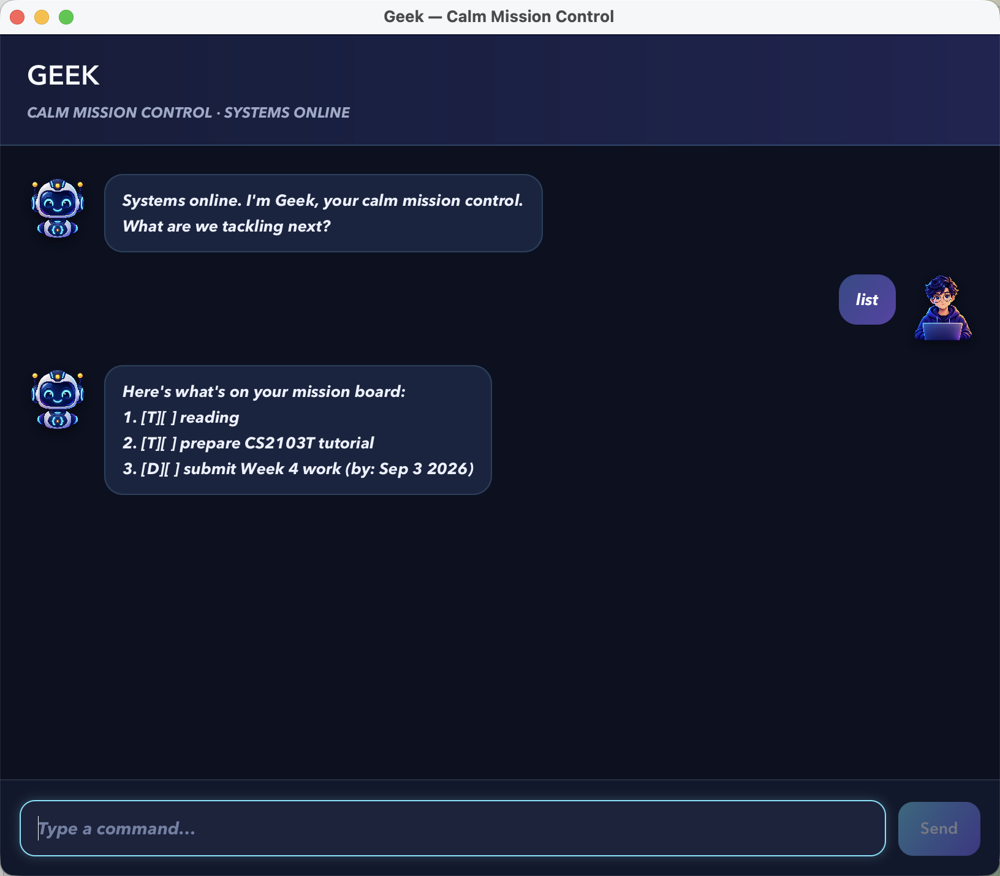

# Geek User Guide

Geek is a calm mission-control desktop assistant for keeping track of todos,
deadlines, and events using short text commands.



## Quick start

1. Install Java 25 and confirm it is active with `java -version`.
2. Download `geek.jar` from the
   [latest Geek release](https://github.com/linziyang2025-byte/ip/releases/latest).
3. Put the JAR file in a folder where Geek may create its `data` folder.
4. Open a terminal in that folder and run `java -jar geek.jar`.
5. Type a command in the box at the bottom of the window and press Enter or
   click **Send**.

Geek saves task changes automatically and restores them the next time it
starts.

## Command summary

| Command | Purpose |
| --- | --- |
| `todo DESCRIPTION` | Add an undated todo |
| `deadline DESCRIPTION /by DATE_OR_DATE_TIME` | Add a deadline |
| `event DESCRIPTION /from DATE_TIME /to DATE_TIME` | Add an event |
| `list` | Show all tasks in their current order |
| `find KEYWORD` | Find tasks whose descriptions contain a keyword |
| `on DATE` | Show deadlines and events occurring on a date |
| `sort` | Put dated tasks in chronological order |
| `mark NUMBER` | Mark a task as complete |
| `unmark NUMBER` | Mark a task as incomplete |
| `delete NUMBER` | Delete a task |
| `bye` | Exit Geek |

Command words and delimiters such as `/by`, `/from`, and `/to` should be typed
in lowercase. Geek accepts extra spaces around and between command parts.

## Adding tasks

### Todo

Use `todo` for a task without a date:

```text
todo read chapter 3
```

### Deadline

Use `deadline` with `/by`. A deadline may have a date only:

```text
deadline submit report /by 18/9/2026
```

You may also include a time:

```text
deadline submit report /by 18/9/2026 2359
```

### Event

Use `event` with both `/from` and `/to`. Events require a date and time at
both ends, and the ending must be later than the starting time:

```text
event project meeting /from Sep 16 2026 2:00 PM /to Sep 16 2026 4:00 PM
```

## Viewing and organizing tasks

Use `list` to display every task. Each task is numbered, and the number is used
by `mark`, `unmark`, and `delete`:

```text
list
```

Use `find` to search task descriptions. The search is not case-sensitive:

```text
find report
```

Use `on` with a date to see deadlines due that day and events that occur on
that day. A multi-day event appears on every date from its start through its
end:

```text
on 18/9/2026
```

Use `sort` to place deadlines and events from earliest to latest. Todos appear
after dated tasks, and tasks with the same date and time keep their existing
order:

```text
sort
```

The sorted order is saved automatically.

## Completing, restoring, and deleting tasks

The number in these commands refers to the task's current position in `list`.
For example:

```text
mark 2
unmark 2
delete 3
```

The status symbols mean:

- `[T][ ]`, `[D][ ]`, or `[E][ ]`: incomplete task
- `[T][X]`, `[D][X]`, or `[E][X]`: completed task

`T`, `D`, and `E` identify todos, deadlines, and events respectively.

## Supported dates and times

Geek checks dates strictly, so impossible dates such as `30/2/2026` are
rejected.

Supported date styles include:

| Style | Example |
| --- | --- |
| Year-month-day | `2026-09-18` |
| Day/month/year | `18/9/2026` |
| Day-month-year | `18-9-2026` |
| Day month year | `18 Sep 2026` |
| Month day year | `Sep 18 2026` |
| Month day, year | `Sep 18, 2026` |

Supported time styles include:

| Style | Example |
| --- | --- |
| 24-hour time | `2359` or `23:59` |
| 12-hour time | `6PM`, `6 PM`, `6:00PM`, or `6:00 PM` |

Month names and AM/PM markers are not case-sensitive. `on` accepts a date
only; events require times; deadlines accept either a date or a date and time.

## Exiting and stored data

Enter `bye` to close Geek cleanly:

```text
bye
```

Geek stores tasks in `data/geek.txt`, relative to the folder from which the
JAR is run. The folder and file are created automatically when needed. If a
stored line is corrupted, Geek skips that line, reports its line number, and
loads the remaining valid tasks.

## Troubleshooting

- If the JAR does not start, run `java -version` and confirm the major version
  is 25.
- Start the app from a terminal using `java -jar geek.jar` so any startup error
  remains visible.
- If Geek rejects a command, read the red response for the required format;
  the app stays open so you can correct and retry the command.
